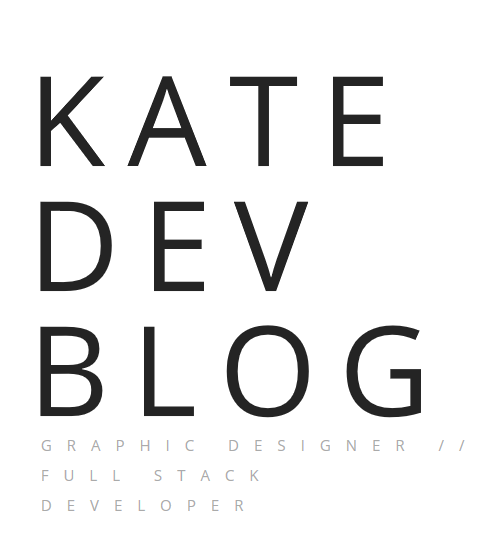

# My personal blog

It's my own personal blog encoded in CSS, HTML, Javascript, and Bootstrap. 

## Coded With:

* [Javascript](https://www.javascript.com/) - Vanilla JavaScript
* [CSS](https://html.com/css/) - Cascading Style Sheets
* [HTML](https://html.com/) - Hypertext Markup Language
* [Bootstrap](https://getbootstrap.com/) - Bootstrap

## Graphic Programs Used:

* [Adobe PS](https://www.adobe.com/products/photoshop.html?sdid=KKQIN&mv=search&s_kwcid=AL!3085!10!79027473338355!20541714965&ef_id=XNC0kQAAAH1MVjCs:20200303011500:s) - Adobe Photoshop
* [Adobe IS](https://www.adobe.com/products/illustrator.html?sdid=KKQML&mv=search&s_kwcid=AL!3085!10!79645985794438!20541717517&ef_id=XNC0kQAAAH1MVjCs:20200303011600:s) - Adobe Illustrator

## Wireframe Used:

* [Figma](https://www.figma.com/) - Figma

## Future Enhancements

* Need to create a database to hold my blog posts in the future, for now it's manually encoded.

## Author

* **Kate Soliven** - *Initial work* - [ksoliven](https://github.com/ksoliven)

## License

This project is licensed under the MIT License - see the [LICENSE.md](LICENSE.md) file for details

## Acknowledgments

* Colorlib
* Coding Dojo
* Adobe
